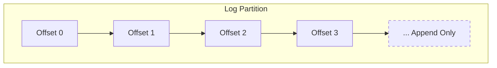
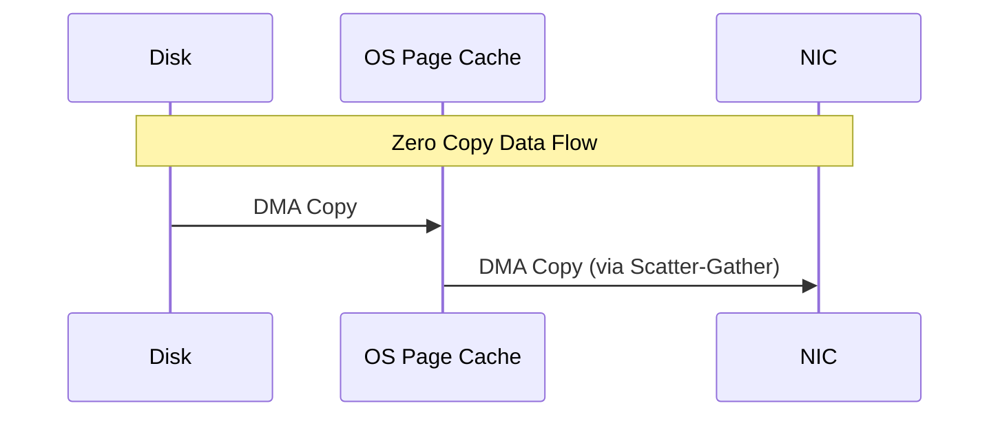

# The Understand of Kafka: A Definitive Guide

很多时候，我们把 Kafka 当作一个黑盒的 "Message Queue" 来使用。但当你试图去调优它，或者在生产环境中遇到 "消息丢失"、"Rebalance 风暴" 时，黑盒就变成了潘多拉魔盒。

这篇文章旨在打破这个黑盒。我们将分层级，从最基础的存储抽象，一直深入到分布式的共识协议，剖析 Kafka 的内部机理。

---

## Level 1: The Concept (核心抽象)

一切始于 **Log (日志)**。

在数据库理论中，Log 是一个**仅追加 (Append-only)**、**完全有序 (Totally Ordered)** 的记录序列。它是最简单，也是最强大的存储抽象。

### Log vs Queue
传统的队列（ActiveMQ, RabbitMQ）通常设计为轻量级的：消息一旦被消费，就随风消散。
而 Kafka 的核心是 **Distributed Commit Log**。
*   **持久化**：消息被消费后依然存在（直到过期或磁盘满）。
*   **重放 (Replay)**：消费者可以回溯到任意位置重新消费，这是流计算（Stream Processing）的基石。



---

## Level 2: Physical Storage (物理存储)

Kafka 的高性能，首先源于它对磁盘的极致利用。让我们看看 `/var/lib/kafka/data` 目录下到底有什么。

### 1. Log Segments (日志分段)
Log 并不只是一个无限长的文件（那样很难维护）。Kafka 将一个 Partition 切分成多个 **Segments**。
每个 Segment 包含三个核心文件：
*   `00000000000000000000.log`: 实际的数据文件。
*   `00000000000000000000.index`: 偏移量索引文件（Offset Index）。
*   `00000000000000000000.timeindex`: 时间戳索引文件（Time Index）。

文件名是该 Segment 的 **Base Offset**（起始偏移量）。

### 2. 稀疏索引 (Sparse Index)
为了节省内存，Kafka 的索引文件是**稀疏**的。它不会为每条消息都建立索引，而是每隔几 KB（默认 4KB）建立一个索引项。

**查找过程 (如查找 Offset 3687)**:
1.  **二分查找 (Memory)**: 在所有 Segment 的文件名中找到对应的 Segment（假设是 `0000..3000.log`）。
2.  **二分查找 (.index)**: 在 `0000..3000.index` 中找到小于等于 3687 的最大 Offset（假设是 3680，物理位置 Position 为 1024）。
3.  **顺序扫描 (Disk)**: 从 `.log` 文件的 Position 1024 开始顺序扫描，直到找到 Offset 3687。

这种设计在空间占用和查找速度之间取得了完美的平衡。

### 3. Log Compaction (日志压缩)
对于某些场景（如 KV 存储的变更日志），我们只关心**最新的值**。
Log Compaction 会后台运行，删除那些 "Key 相同但 Offset 较旧" 的消息。这使得 Kafka 可以作为一种持久化的 KV 数据库使用。

---

## Level 3: The Network & Hardware (极致性能)

Kafka 为什么能达到百万级的 TPS？因为它顺应了硬件的特性，而不是对抗它。

### 1. Sequential I/O (顺序 I/O)
在机械硬盘 (HDD) 时代，**随机 I/O** 是性能杀手（因为磁头要跳来跳去）。但 **顺序 I/O** 的速度可以达到几百 MB/s，甚至超过内存随机访问的速度。
Kafka 的 Log 结构强制 **Append-only**，保证了严格的顺序写。

### 2. Zero Copy (零拷贝)
从磁盘读取数据并通过网络发送，传统路径是：
`Disk -> OS Cache -> User Buffer -> Socket Buffer -> NIC Buffer`
也就是：**4 次拷贝，4 次上下文切换**。

Kafka 利用 Linux 的 `sendfile` (Java `FileChannel.transferTo`)：
`Disk -> OS Cache -> NIC Buffer`
也就是：**2 次拷贝 (其中一次是 DMA)，2 次上下文切换**。CPU 全程几乎不参与数据搬运。



### 3. Page Cache
Kafka 甚至不管理堆内缓存（Heap Cache），而是完全依赖操作系统的 **Page Cache**。
*   **JVM 只有 32GB 限制**，而 OS Cache 可以用完剩余的 100GB 内存。
*   **GC 无负担**：缓存对象在堆外，不增加 GC 压力。
*   **重启不丢失**：进程重启，Page Cache 依然在内存中（只要机器没重启）。

---

## Level 4: The Distributed Protocol (分布式核心)

单机再快也有极限，分布式才是 Kafka 的灵魂。

### 1. Partition & Replication
每个 Partition 都有一个 **Leader** 和多个 **Follower**。
*   **Leader**: 处理所有的读写请求。
*   **Follower**: 只是从 Leader 被动拉取消息（像 Consumer 一样）。

### 2. ISR (In-Sync Replicas)
Kafka 不要求所有 Follower 都同步完消息才确认提交（太慢），也不允许只要 Leader 写完就确认（不安全）。
它引入了 **ISR** 集合：
*   ISR = {Leader, Follower A, Follower B...}
*   只有 ISR 中的节点都同步了消息，该消息才被视为 **Committed**。
*   如果 Follower 太慢（超过 `replica.lag.time.max.ms`），会被踢出 ISR。

### 3. HW & LEO
*   **LEO (Log End Offset)**: 日志末端位移，记录写入的最新消息位置。
*   **HW (High Watermark)**: 高水位，ISR 中所有节点最小的 LEO。
*   **Consumer 只能看到 HW 之前的消息**。这保证了即使 Leader 挂了，消费者读到的数据也不会丢失。

```mermaid
graph TD
    subgraph "Leader (LEO=10)"
    L_Recs[Messages 0..9]
    end
    
    subgraph "Follower A (LEO=10)"
    FA_Recs[Messages 0..9]
    end
    
    subgraph "Follower B (LEO=8, Slow)"
    FB_Recs[Messages 0..7]
    end
    
    L_Recs --> FA_Recs
    L_Recs --> FB_Recs
    
    Note over L_Recs, FB_Recs: HW = min(10, 10, 8) = 8
    Note over L_Recs: Consumers can only read up to Offset 8
```

### 4. Consensus: ZooKeeper vs KRaft
*   **Legacy (ZooKeeper)**: Broker 的元数据（谁是 Leader）存在 ZK 中。Controller 负责监听 ZK 变化。
    *   *缺点*: ZK 是瓶颈，元数据加载慢，Leader 切换慢。
*   **Modern (KRaft)**: 移除 ZK。Kafka 内部实现了一个基于 Raft 的 **Metadata Quorum**。Controller 也是一个 Log Partition，元数据变更就是追加 Log。这使得 Kafka 可以轻松支持百万级 Partition。

---

## Level 5: The Consumer Protocol (协同机制)

Kafka 的消费者组（Consumer Group）是一个完全去中心化的协同系统。

### Rebalance (重平衡)
当消费者上线、下线，或者 Topic 扩容时，Partition 需要重新分配。这个过程叫 Rebalance。

*   **Eager Rebalance (Stop-the-world)**:
    传统的协议。所有消费者停止消费，放弃所有 Partition，重新分配。会有短暂的服务不可用（STW）。
*   **Cooperative Rebalance (Incremental)**:
    新的协议（KIP-429）。只移动需要移动的 Partition，其他的继续消费。大大减少了抖动。

---

## Level 6: Delivery Semantics (交付语义)

### 1. Idempotent Producer (幂等生产者)
解决 "网络超时导致重试，从而产生重复消息" 的问题。
Producer 被分配一个 **PID (Producer ID)**，发出的每条消息带一个 **Sequence Number**。
Broker 发现 `SeqNum <= LastSeqNum` 就直接丢弃。
*   无需配置，默认开启。
*   只能保证**单分区、单会话**的幂等。

### 2. Transactions (事务)
解决 "Read-Process-Write" 的原子性（比如从 Topic A 读，处理，写入 Topic B）。
Kafka 借鉴了 2PC (两阶段提交)，引入了 **Transaction Coordinator**。
*   引入 **Commit Marker**：一种特殊的不可见消息，标志着事务的结束。
*   消费者只有在配置 `isolation.level=read_committed` 时，才会等待 Marker 出现，确认事务成功后再把消息吐给用户。

---

## 结语

Kafka 表面简单（Topic, Partition, Producer, Consumer），内部却是一个精密复杂的分布式数据库。
从**文件系统的顺序读写**，到**操作系统的 Page Cache**，再到**分布式协议的 ISR 和 Epoch**，每一层设计都在为**高吞吐、高可用、高可靠**服务。

理解了这些，你就不再只是一个 API Caller，而是一个能驾驭流数据的架构师。
